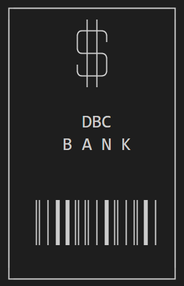
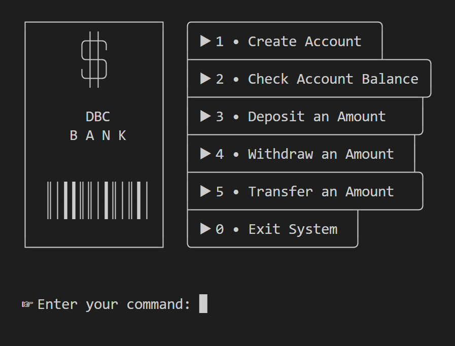

<br/>
<p align="center">
  <a href="https://github.com/daltonbc96/python-oop-projects">
    
  </a>
  <h3 align="center">DBC Bank System</h3>

  <p align="center">
    An application for practicing Object-Oriented programming concepts in the Python
    <br/>
    <br/>
    <br/>

  </p>
</p>


 
  

## Table Of Contents

* [About the Project](#about-the-project)
* [Getting Started](#getting-started)
  * [Prerequisites](#prerequisites)
  * [Installation](#installation)
* [License](#license)
* [Authors](#authors)

## About The Project
<p align="center">
  
</p>
{: width=50% }

This is a Python project for practicing object-oriented programming concepts. This project allows users to create a checking or savings account and perform financial transactions between accounts.

This project allowed me to practice the concepts of inheritance, abstract classes using the [ABC](https://docs.python.org/3/library/abc.html) @abstractmethod annotation or decorator, overriding, and polymorphism. In addition, an interactive menu was created so that the user could operate the application through the terminal.

The application includes classes and methods for creating accounts and performing financial transactions. You can create different current or savings accounts, check the balance, and carry out the following financial transactions: withdrawal, transfer, and deposit. See the list of features below. 

### Features 

- Create Account
  - Checking Account
  - Savings Account
- Check Account Balance
- Deposit an Amount
- Withdraw an Amount
- Transfer an Amount 
- Exit System


## Getting Started

To run this application locally follow the instructions below. 

### Prerequisites

Be sure you have the following installed on your development machine:

Python >= 3.7
Git


### Installation

1. Clone the repo

```sh
git clone git@github.com:daltonbc96/python-oop-projects.git
cd banking-system-project
```

2. Run the application locally

```sh
python main.py
```


## License

Distributed under the MIT License. See [LICENSE](https://github.com/daltonbc96/python-oop-projects/blob/master/LICENSE.md) for more information.

## Authors

* [Dalton Costa](https://github.com/daltonbc96)